# Blackjack - JavaScript Game

A dynamic, free-to-play online blackjack game built using HTML, CSS and JavaScript.

[Live site](https://blackjack.2023-bertr.dev.io-academy.uk/)

## Introduction

Grab a seat at the virtual table, it’s time to play blackjack!

The aim of this project was to improve my JavaScript proficiency through building a fun and visually-appealing online version of this classic casino game. While blackjack may seem like a relatively simple game at first glance, I thought its nuanced rules would pose an interesting challenge from a game logic perspective.

I used HTML and Tailwind CSS for the interface, and plain JavaScript for game logic and DOM manipulation. Foregoing a framework allowed me to focus on writing efficient game functions, while keeping the codebase simple and lightweight.

The biggest challenge I faced was implementing the ability to ‘split’ hands, which required substantial refactoring of the existing code. It was also my first time working with modals and CSS animations.

I hope you enjoy my efforts; may the cards be in your favour!

## Features

- **Simple gameplay.** With all the classic blackjack features.
- **Interactive interface.** Clean, intuitive interface for placing bets and making game decisions.
- **Card animations.** Card dealing and hand result animations enhance the gaming experience.
- **Dynamic game updates.** Hand scores, along with bet and wallet values update in real-time.
- **Comprehensive instructions.** Detailed instructions on how to play and the table-specific rules.
- **Mobile and desktop compatible.** Play the game on any device, thanks to responsive design.

## Screenshots

### Mobile

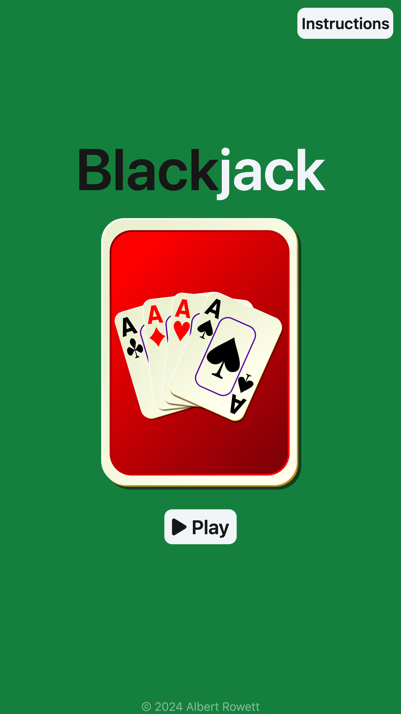 &nbsp;
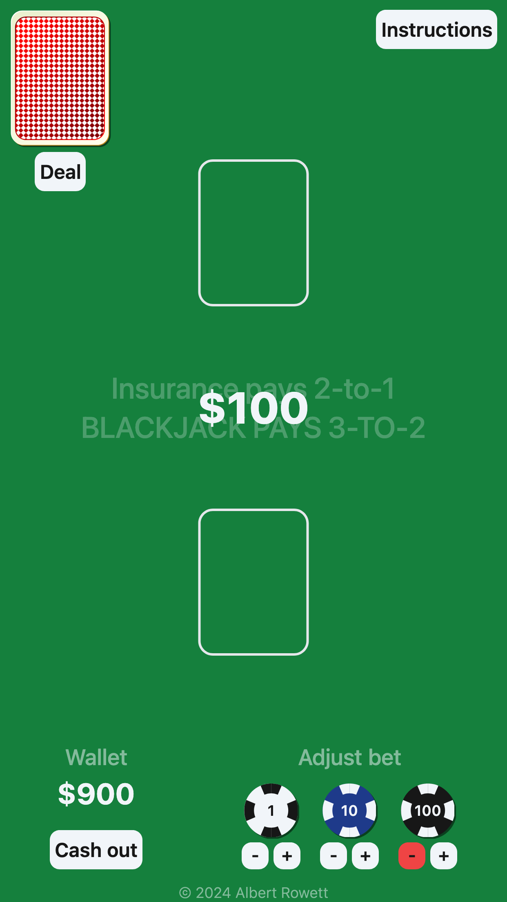 &nbsp;
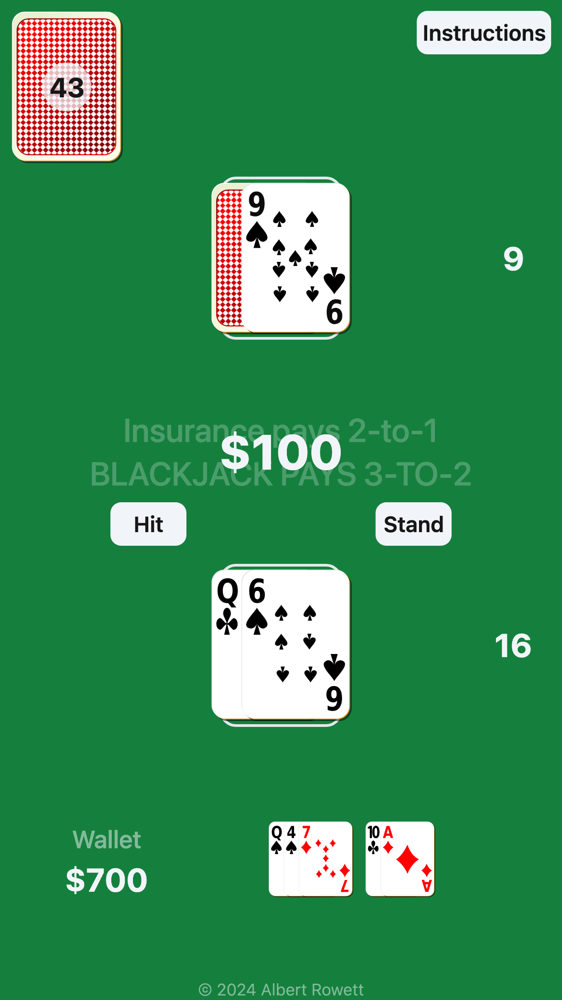 &nbsp;
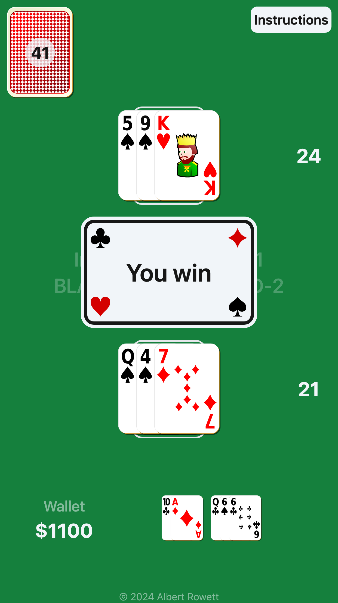 &nbsp;
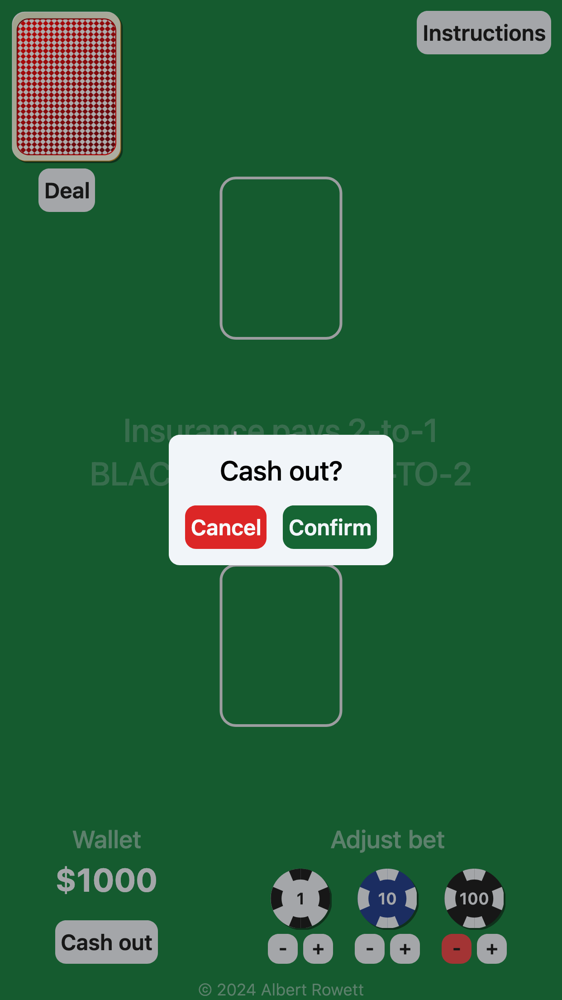 &nbsp;
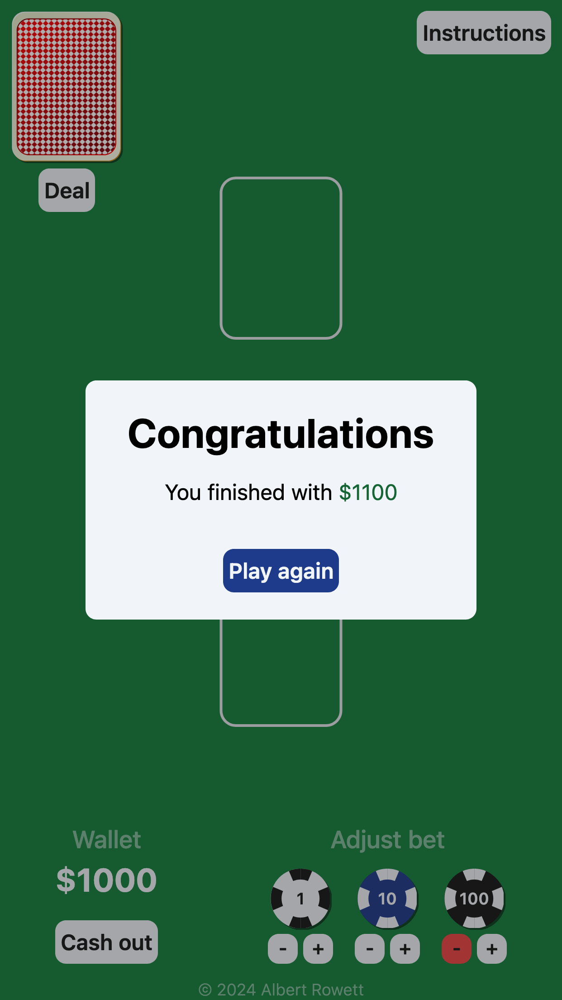

### Desktop

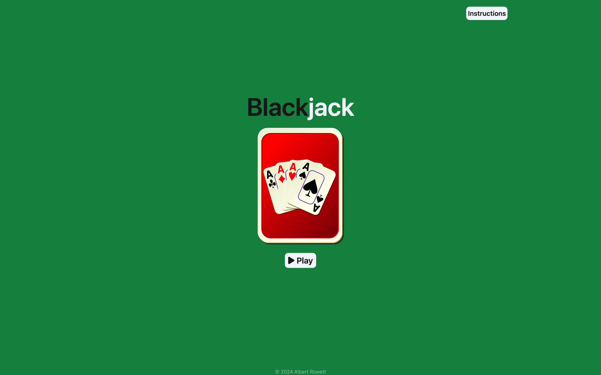 &nbsp;
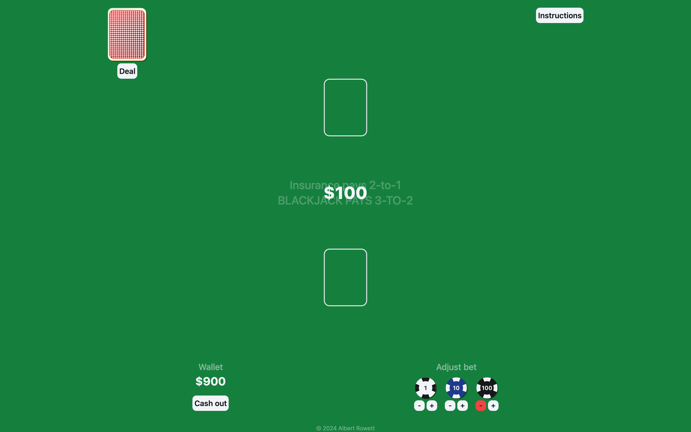 &nbsp;
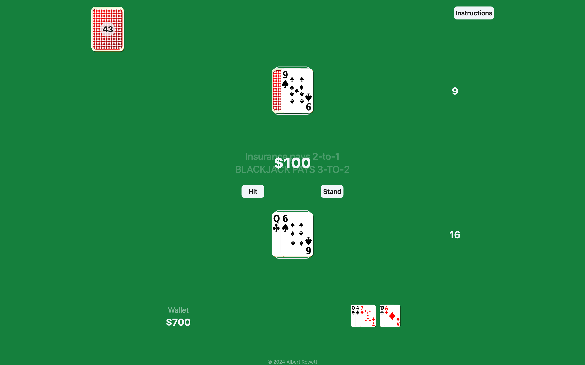 &nbsp;
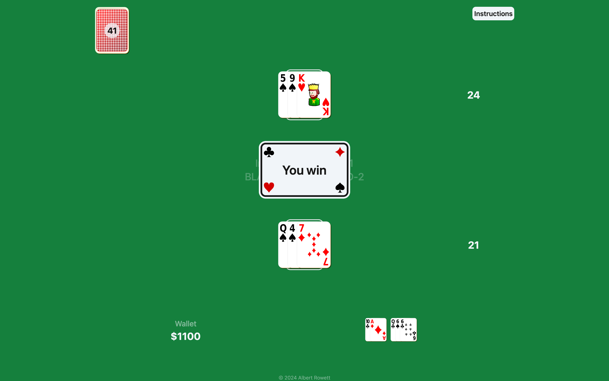 &nbsp;
 &nbsp;
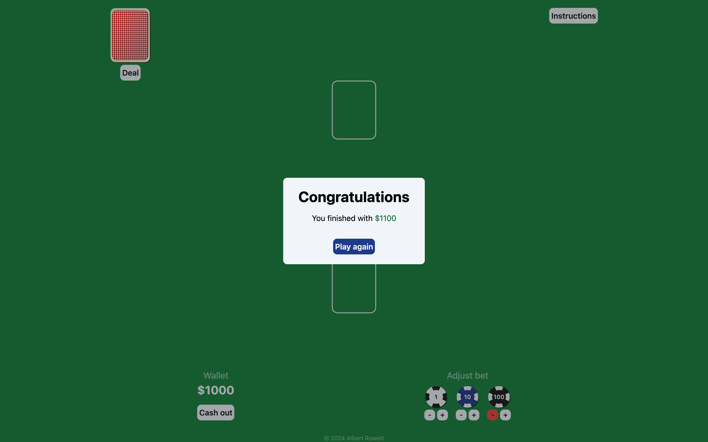

## Installation

1. Clone the repository:

&nbsp;&nbsp;&nbsp;&nbsp;&nbsp;&nbsp;&nbsp;&nbsp;`git clone https://github.com/albertRowett/blackjack.git`

2. Navigate to the project directory:

&nbsp;&nbsp;&nbsp;&nbsp;&nbsp;&nbsp;&nbsp;&nbsp;`cd blackjack`

3. Install dependencies:

&nbsp;&nbsp;&nbsp;&nbsp;&nbsp;&nbsp;&nbsp;&nbsp;`npm install`

4. Access the game:

&nbsp;&nbsp;&nbsp;&nbsp;&nbsp;&nbsp;&nbsp;&nbsp;Open `index.html` (found in the `src` directory) in a browser or use a local development server.

## Contributing

While no major updates are planned for this project, I welcome bug reports and suggestions for improvements. Drop me an email at <albertRowett@gmail.com>.

## Acknowledgements

Inspiration for gameplay and visuals:
- [https://www.arkadium.com/games/blackjack/](https://www.arkadium.com/games/blackjack/)

Help with game rules:
- [https://bicyclecards.com/how-to-play/blackjack](https://bicyclecards.com/how-to-play/blackjack)
- [https://en.wikipedia.org/wiki/Blackjack](https://en.wikipedia.org/wiki/Blackjack)
- [https://www.888casino.com/blog/blackjack-strategy/even-money](https://www.888casino.com/blog/blackjack-strategy/even-money)

Royalty-free image source:
- [https://pixabay.com/](https://pixabay.com/)

 

*All last accessed 8 April 2024*
